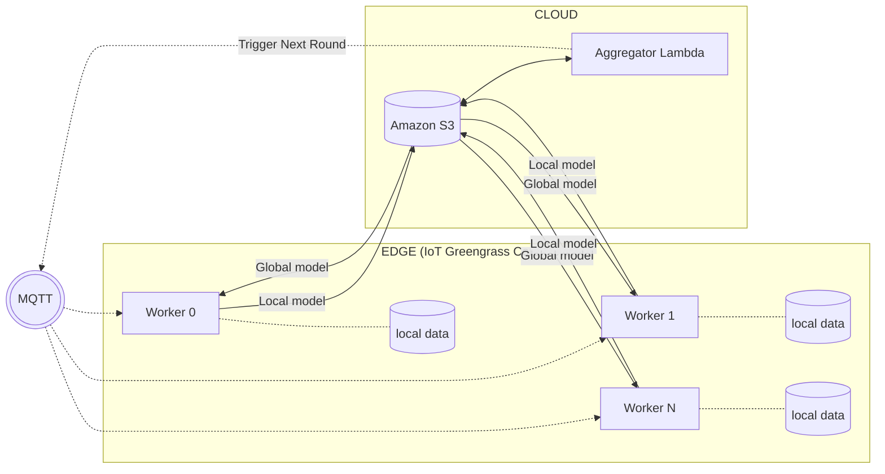

# AWS Edge-to-Cloud Federated Learning Cluster

## Overview
This project implements a distributed Federated Learning (FL) system that trains a LeNet-5 neural network across edge and cloud devices. Instead of centralizing raw data, the system utilizes a decentralized approach where local devices download a global model, train it on local data partitions, and upload only the updated weights.

An AWS Lambda aggregator then calculates the federated average (FedAvg) and orchestrates the next training round via MQTT. 

## Architecture & Features
* **Heterogeneous Hardware Support:** Successfully integrated a physical edge device (Raspberry Pi) with a cloud-based fleet of 10 AWS EC2 instances, ensuring seamless cross-platform execution.
* **Secure Edge Computing:** Deployed the edge worker as an AWS IoT Greengrass component, managing AWS Token Exchange Service credentials for secure S3 communication.
* **Event-Driven Aggregation:** Utilized AWS Lambda triggered by S3 bucket events to aggregate model weights, automatically broadcasting round-progression signals via AWS IoT Core (MQTT).
* **Fault Tolerance:** Implemented custom hardware-aware detection and fallback logic to handle race conditions and network latency disparities between high-speed cloud nodes and physical edge devices.

## How It Works
1.  **Trigger:** An initial MQTT signal is published to the IoT topic.
2.  **Local Training:** The edge device and EC2 instances download the `global_model.npz` from S3 and execute local PyTorch training epochs on their unique data partitions.
3.  **Upload:** Workers serialize their state dictionaries and upload the local weights back to S3.
4.  **Aggregation:** A Lambda function catches the S3 upload events, waits for a complete quorum of all 10 nodes, calculates the FedAvg, saves the new global model, and triggers the next round.

## System Architecture

